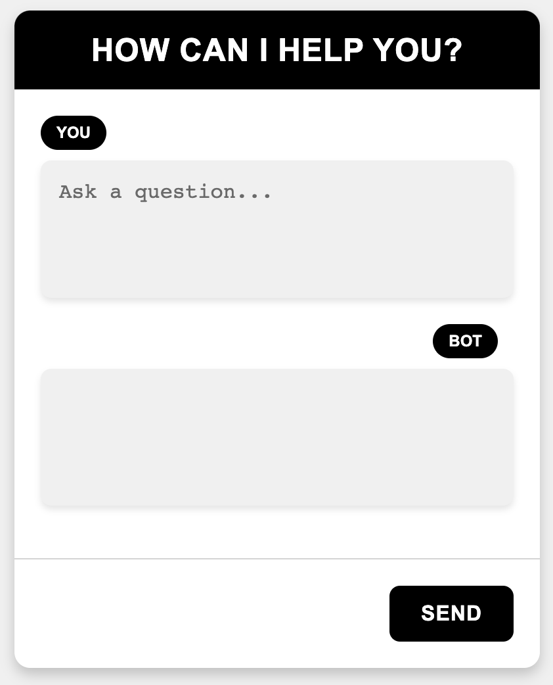

Django GPT Form
===============

Installation
------------

Install the development version into your python environment using pip:

::

   pip install .

Add ``gpt_form`` to your ``INSTALLED_APPS`` and set ``OPENAI_API_KEY``
to your OpenAI API key in settings.py:

.. code:: python

   INSTALLED_APPS = (
       # ...,
       'gpt_form',
   )

   OPENAI_API_KEY = '<your-api-key>'

Include ``gpt_form.urls`` in urls.py:

.. code:: python

   urlpatterns = [
       path('', include('gpt_form.urls')),
   ]

Usage
-----

Load the ``gpt_form`` tag library and use the ``completion_form`` tag to
render the
`Completion <https://platform.openai.com/docs/api-reference/completions>`__
form:

.. code:: html

   

   

Optional Configuration
----------------------

| By default, only the required parameter ``model`` is set to
  ``text-davinci-003``.
| If you want to change the parameters, add the following settings to
  settings.py:

.. code:: python

   OPENAI_COMPLETION = {
       'model': 'text-davinci-003',
       'max_tokens': 100,
       'temperature': 1,
       'top_p': 1,
       'presence_penalty': 0,
       'frequency_penalty': 0
   }
